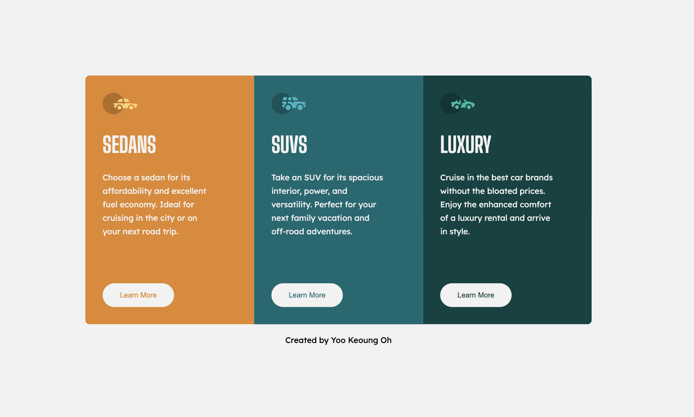

# Frontend Mentor - 3-column preview card component

## Welcome! 👋

Thanks for visiting my submission repository

[Frontend Mentor](https://www.frontendmentor.io) challenges help you improve your coding skills by building realistic projects.

## The challenge

This challenge is to build out this 3-column preview card component and get it looking as close to the design as possible.

mpletely free. Please share it with anyone who will find it useful for practice.

## Created by

Yoo keoung (Kate) Oh

instagram: [@yookeoungoh](https://www.instagram.com/yookeoungoh/)
